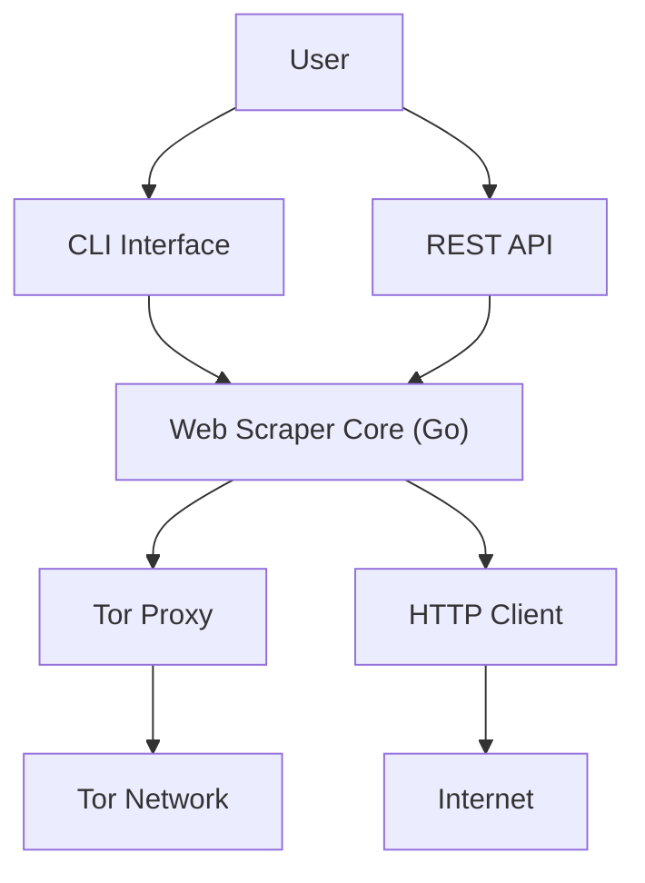

# GoTor - HTTP REST API and Web Crawling Tool with TOR Integration

This repository contains an HTTP REST API and a command-line program designed for efficient data gathering and analysis through web crawling using the TOR network. While the program is primarily designed to work seamlessly with TorBot, the API and CLI can also operate independently.

## Status/Social Links
[](https://github.com/DedSecInside/gotor/actions/workflows/go.yml)
[](https://www.codetriage.com/kingakeem/gotor)
[]()


## Features and Options

### Main Arguments
* `-url`: URL to crawl. (Required Argument)
* `-depth`: Depth of the tree. (default: 1)

### TOR Integration
The program employs the TOR network for enhanced privacy and security during web crawling. TOR settings can be configured using environment variables or overridden using CLI flags.

* `-socks5-host`: Specify the SOCKS5 proxy host (default: localhost / 127.0.0.1)
* `-socks5-port`: Specify the SOCKS5 proxy port (default: 9050)
* `-disable-socks5`: Run the program without the SOCKS5 proxy. 

### Other options (Deprecated)

### REST API
* `-server-host`: Specify the host that the server runs on (default: localhost / 127.0.0.1)
* `-server-port`: Specify the port that the server runs on (default: 8081)
* `-s`: Run the program as a service

* `-d`: Download the results to an Excel spreadsheet (.xlsx)
* `-f`: Output format for the results. Options are list or tree. (default: list)

### Available Crawling Mechanisms
1. **Building Relationship Tree of Links**: Generates a hierarchical tree of links, with child nodes representing links found on a website.
2. **Getting Tor Client IP**: Retrieves the IP address of the current TOR client.
3. **Retrieving Phone Numbers**: Collects phone numbers found on websites.
4. **Retrieving Emails**: Gathers email addresses found on websites.

#### Example Usage
To start the HTTP server and initiate crawling, use the following command: (Deprecated)
```bash
go run cmd/main/gotor.go -s
```

w/ alternate host and port for server and SOCKS5 proxy: (Deprecated)
```bash
go run cmd/main/gotor.go -s -server-host 192.6.8.124 -server-port 8088 -socks5-host 127.0.0.1 -socks5-port 9051
```

To crawl directly using the CLI, use the following command:
```bash
go run cmd/main/gotor.go -url https://example.com -depth 2
```

## Running with Docker
To run the server using Docker, a convenience script build.sh is provided. This script builds a Docker network service for Tor and connects it to the "gotor" Docker container.
Make sure no other service is using the same port. The script uses the SOCKS5_PORT.

### To build and start the Docker containers:
```bash
./scripts/build.sh
```
### To stop and destroy the Docker containers:
```bash
./scripts/destroy.sh
```

## Architecture

**Description:**
- Users interact via CLI or REST API.
- Both interfaces connect to the Go-based scraper core.
- The scraper routes requests via Tor or standard HTTP.
- Requests reach either the Tor network or the normal Internet.

## Documentation
This project includes comprehensive code comments to facilitate documentation generation with godoc. To generate and access documentation, use the following command:

```bash
godoc -v -http=:6060
```
This will make the documentation available at http://127.0.0.1:6060.

## License
This project is licensed under the GNU General Public License.

Feel free to contribute, report issues, or suggest improvements!
